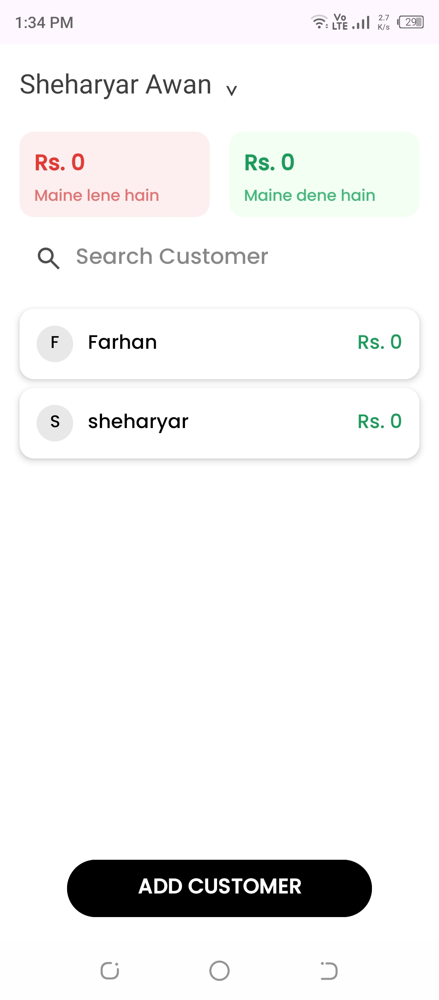
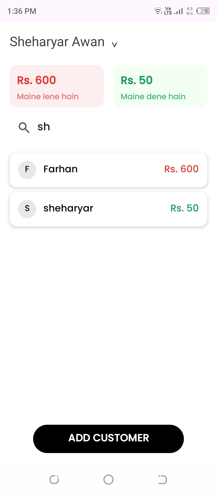
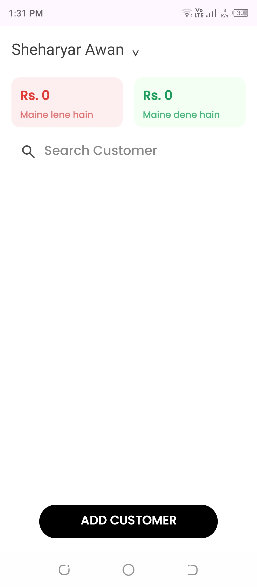
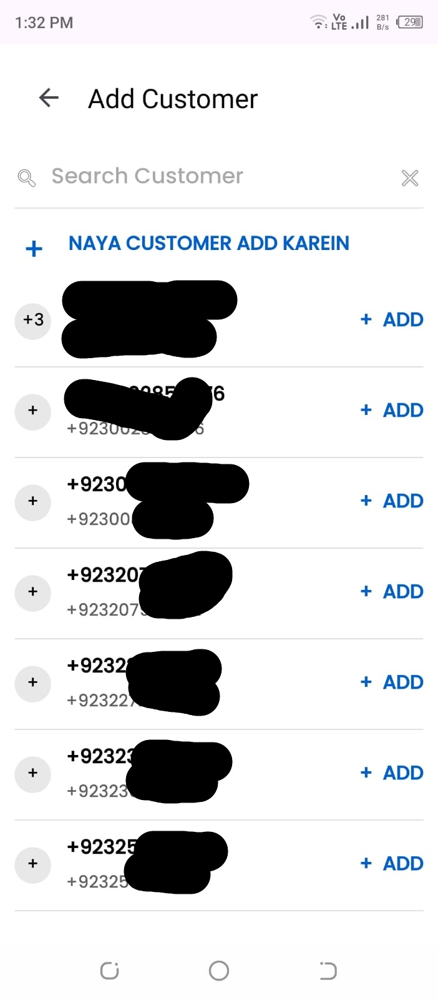
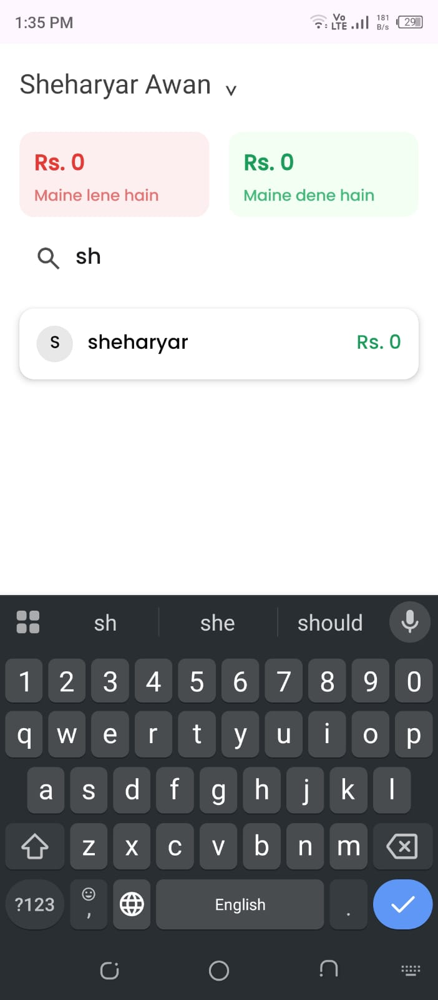
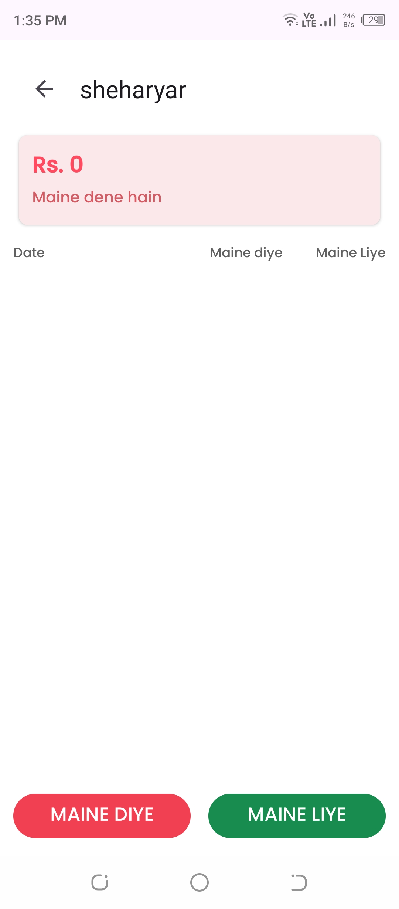
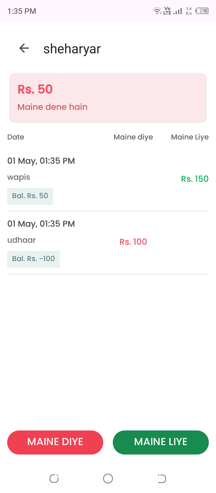
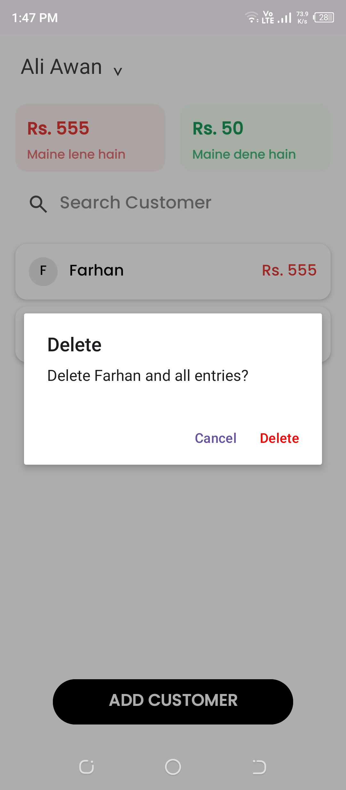
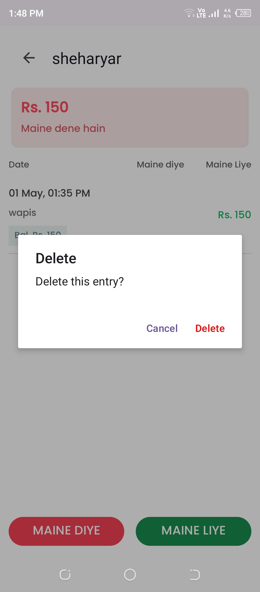
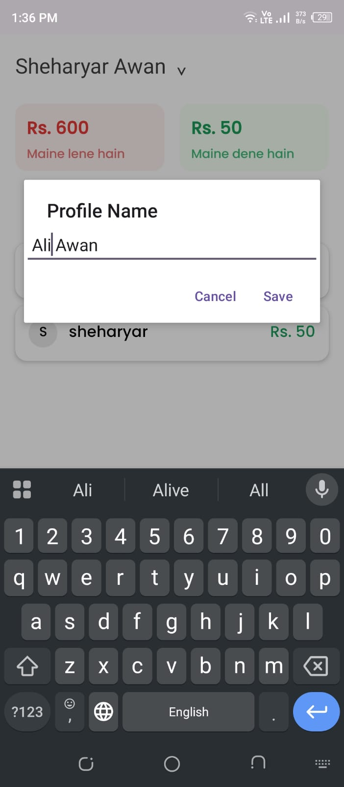

# 📊 HisabKitaab – Personal Finance Management App

HisabKitaab is an Android application designed to manage customer-based credit and debit records in a simple and efficient way.<br> It helps users track who owes them money and whom they owe, with clear transaction history and balance calculations.

---

## Features

-  Add and manage customers
-  Track debit and credit transactions
-  Automatic balance calculation
-  Search customers by name or phone number
-  Detailed customer transaction history
-  Delete customer or individual transactions
-  Running balance per transaction
-  Clean and simple UI with Material Design

---

##  Tech Stack

- Kotlin (Android)
- Room Database
- RecyclerView
- Navigation Component
- Coroutines (Lifecycle + IO handling)
- Material Design Components
- XML Layouts

---

##  Architecture

- MVVM-inspired structure (Repository + DAO pattern)
- Room Database for local persistence
- Separation of concerns between UI and data layer

---
## 📸 Screenshots

###  Home Screen





---

###  Add / Manage Customer



---

###  Customer Details



---

###  Transactions


---

###  Edit Features


---

###  Delete Features



---

###  Profile


---

###  Splash Screen


---


## ⚙️ How to Run Project

1. Clone this repository
```bash
git clone https://github.com/sheharyarawan/hisabkitaab.git
```
2. Open the project in Android Studio
   Launch Android Studio
   Click on Open
   Select the cloned hisabkitaab folder
3. Let Gradle sync
   Wait for Android Studio to download all dependencies automatically
   If prompted, click Sync Now
   Set up SDK (if required)
4. Go to File > Settings > Android SDK
   Install required SDK platforms and build tools
5. Run the app
   Connect an Android device or start an emulator
   Click the Run ▶ button in Android Studio
